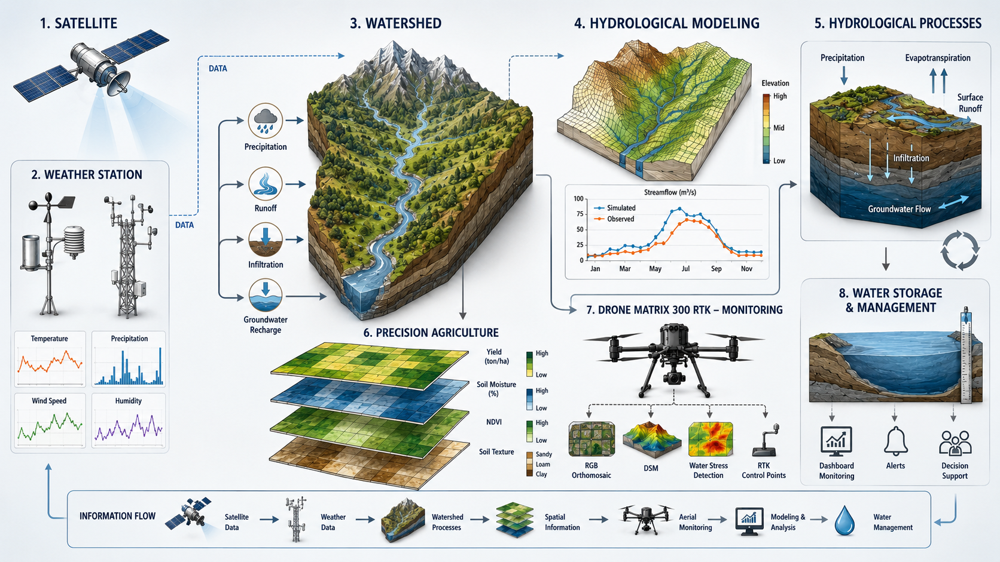

<!--
  README · José Luis Huanuqueño Murillo
  Design language inspired by top GitHub profiles (Anurag Hazra, Orhun, Caneco, Abhishek Naidu)
  · brand palette: forest #1F4E3C · terracotta #7A1F1F · charcoal #2F2F2F · ivory #FAFAFA
  · badge system: for-the-badge (social) + flat-square (tech)  · serif headlines
-->

<p align="center">
  
</p>

<h1 align="center">
  José&nbsp;Luis&nbsp;Huanuqueño&nbsp;Murillo
</h1>

<p align="center">
  <sub><i>Agricultural Engineer · M.Sc. Candidate · Earth Observation Researcher · Agro-Hydrology Scientist</i></sub>
</p>

<p align="center">
  <sub><i>Universidad Nacional Agraria La Molina &nbsp;·&nbsp; Departamento de Recursos Hídricos &nbsp;·&nbsp; Lima, Perú</i></sub>
</p>

<p align="center">
  
</p>

<!-- =================== ACADEMIC & SOCIAL PRESENCE =================== -->

<p align="center">
  <a href="mailto:joluhumu98@gmail.com"></a>&nbsp;
  <a href="https://www.linkedin.com/in/jlhm98/"></a>&nbsp;
  <a href="https://www.researchgate.net/profile/Jose-Huanuqueno-Murillo"></a>&nbsp;
  <a href="https://x.com/Joselhm98"></a>
</p>

<p align="center">
  &nbsp;
  &nbsp;
  &nbsp;
  &nbsp;
  &nbsp;
  
</p>

<p align="center">
  <a href="#-about-me">About</a> &nbsp;·&nbsp;
  <a href="#-research-statement">Research</a> &nbsp;·&nbsp;
  <a href="#-now--current-focus">Now</a> &nbsp;·&nbsp;
  <a href="#-featured-publication">Featured</a> &nbsp;·&nbsp;
  <a href="#-selected-publications">Publications</a> &nbsp;·&nbsp;
  <a href="#-software--datasets">Software</a> &nbsp;·&nbsp;
  <a href="#-technical-stack">Stack</a> &nbsp;·&nbsp;
  <a href="#-github-activity">Activity</a> &nbsp;·&nbsp;
  <a href="#-collaborate">Collaborate</a>
</p>

---

## 👨‍🔬 About me

```yaml
name:        José Luis Huanuqueño Murillo
role:        Agricultural Engineer · M.Sc. Candidate
affiliation: UNALM — Departamento de Recursos Hídricos
location:    Lima, Perú  🇵🇪
recognition: RENACYT · Investigador Nivel VI (CONCYTEC)

research:
  themes:
    - Earth Observation for sustainable agriculture
    - UAV thermal & multispectral photogrammetry (RTK)
    - Surface energy balance — METRIC · SEBAL · TSEB
    - Machine learning for evapotranspiration & yield
  field_sites:
    - Lambayeque · La Molina
    - Peruvian coastal rice & sugarcane systems
  current_crop: Oryza sativa (rice) under AWD irrigation

stack:
  remote_sensing: [Sentinel-2, Landsat 8/9, MODIS, GEE]
  uav:           [DJI M3E, M3M, M3T, Matrice 350 RTK, P4 RTK]
  modeling:      [METRIC, SEBAL, TSEB, AquaCrop, FAO-56 PM]
  data_science:  [Python, R, scikit-learn, XGBoost, RF, SVR]

contact:
  email:    joluhumu98@gmail.com
  linkedin: jlhm98
  rg:       Jose-Huanuqueno-Murillo
```

---

## 🔬 Research statement

> *"Bringing satellites, drones, and data science together to grow more food with less water across the fragile agroecosystems of Peru."*

I am an **Agricultural Engineer** and **M.Sc. candidate** at the *Universidad Nacional Agraria La Molina (UNALM)*, working at the crossroads of **Earth Observation**, **precision agriculture**, and **water resources management**. My research integrates **Sentinel-2 / Landsat 8–9** optical and thermal imagery, **UAV thermal & multispectral RTK photogrammetry**, **one- and two-source surface energy balance models** (METRIC · SEBAL · TSEB), and **machine learning** to deliver actionable evapotranspiration, water-stress, and crop-yield diagnostics for Peruvian coastal and Andean cropping systems.

Recognized by **CONCYTEC (RENACYT — Investigador Nivel VI)**, I have co-authored peer-reviewed contributions in *Remote Sensing* and *Agriculture* (MDPI · Q1), developed and registered scientific software (**ThermiCAL**, INDECOPI 2025), and contributed to international scientific fora including the **IAHR World Congress** and the **Congreso Latinoamericano de Hidráulica**.

<details>
<summary><b>🇪🇸 Versión en español — Perfil académico</b></summary>

<br>

> *"Integrar satélites, drones y ciencia de datos para producir más alimentos usando menos agua en los agroecosistemas frágiles del Perú."*

Soy **Ingeniero Agrícola** y **candidato a M.Sc.** en la *Universidad Nacional Agraria La Molina (UNALM)*. Mi línea de investigación se sitúa en la intersección entre la **teledetección**, la **agricultura de precisión** y la **gestión integrada del agua**, combinando imágenes **Sentinel-2 / Landsat 8–9**, **fotogrametría UAV térmica y multiespectral con RTK**, **modelos de balance de energía** (METRIC · SEBAL · TSEB) y **aprendizaje automático** para generar información operativa de evapotranspiración, estrés hídrico y rendimiento en sistemas agrícolas de la costa y sierra peruana.

Reconocido por **CONCYTEC (RENACYT — Investigador Nivel VI)**, soy coautor de publicaciones en *Remote Sensing* y *Agriculture* (MDPI, Q1), desarrollador de software registrado (**ThermiCAL**, INDECOPI 2025), y ponente en foros internacionales como el **IAHR World Congress** y el **Congreso Latinoamericano de Hidráulica**.

**Disponibilidad** — Estancias postdoctorales y de investigador visitante · Colaboraciones en evapotranspiración, estrés hídrico e irrigación climáticamente inteligente · Consultorías en asesoría de riego, calibración térmica UAV y pipelines multitemporales en GEE · Co-asesoría de tesis de M.Sc. / Ph.D.

</details>

---

## 🚀 Now — current focus

<table>
<tr>
<td width="50%" valign="top">

**🛰️ Multitemporal GEE pipelines**

Scaling UAV thermal & multispectral workflows into **Google Earth Engine** chains for large-area monitoring across Peruvian coastal valleys.

</td>
<td width="50%" valign="top">

**🌾 Sentinel-2 + UAV fusion for rice yield**

Building **machine-learning models** that fuse satellite and UAV imagery to predict yield under **Alternate Wetting and Drying (AWD)** irrigation.

</td>
</tr>
<tr>
<td width="50%" valign="top">

**💧 CWSI & TSEB diagnostics**

Refining **water-stress diagnostics** and **two-source energy balance** partitioning for sub-optimally irrigated coastal valleys.

</td>
<td width="50%" valign="top">

**🛠️ Open thermal toolchains**

Maturing **ThermiCAL** into a reproducible UAV thermal-calibration toolkit, democratizing CWSI workflows across LATAM institutions.

</td>
</tr>
</table>

---

## ⭐ Featured publication

<table>
<tr>
<td width="140" align="center" valign="top">

<sub><b>2026</b></sub><br><br>
<br>
<sub><b>Remote<br>Sensing</b></sub><br>
<sub>18(6), 856</sub>

</td>
<td valign="top">

### UAV & Satellite Remote Sensing for Agriculture in Peru
<sub><i>Huanuqueño-Murillo, J. L. et al. (2026)</i></sub>

A multi-scale Earth Observation framework integrating **UAV thermal/multispectral photogrammetry** with **Sentinel-2 / Landsat** time-series for operational agricultural monitoring across Peruvian agroecosystems.

<a href="https://doi.org/10.3390/rs18060856"></a>
&nbsp;<a href="https://www.mdpi.com/2072-4292/18/6/856"></a>

</td>
</tr>
</table>

---

## 🧭 Career highlights

<table>
<tr><td align="center" width="56">🎓</td><td><b>M.Sc. candidate</b> — Water Resources Engineering, UNALM &nbsp;·&nbsp; <b>B.Sc.</b> Agricultural Engineering</td></tr>
<tr><td align="center">🏅</td><td><b>RENACYT — Investigador Nivel VI</b> · CONCYTEC, Perú</td></tr>
<tr><td align="center">📄</td><td><b>6 peer-reviewed publications</b> in Q1 MDPI journals — <i>Remote Sensing</i> &amp; <i>Agriculture</i></td></tr>
<tr><td align="center">💾</td><td><b>Registered software</b> — <i>ThermiCAL</i>, UAV thermal calibration toolkit (INDECOPI · 2025)</td></tr>
<tr><td align="center">🎙️</td><td><b>Invited speaker</b> — IAHR World Congress &nbsp;·&nbsp; Congreso Latinoamericano de Hidráulica</td></tr>
<tr><td align="center">🛩️</td><td><b>DGAC-licensed UAV pilot</b> — DJI Mavic 3E · 3M · 3T · Matrice 350 RTK · Phantom 4 RTK</td></tr>
<tr><td align="center">🌾</td><td><b>Field experience</b> — Lambayeque · La Molina · Peruvian coastal rice &amp; sugarcane systems</td></tr>
</table>

---

## 🎯 Research interests

<table>
<tr>
<td width="50%" valign="top">

**🛰️ Earth Observation**
- Optical & thermal remote sensing — Sentinel-2, Landsat 8/9, MODIS
- UAV thermal & multispectral photogrammetry (RTK)
- Multitemporal analysis on Google Earth Engine

**💧 Agro-Hydrology**
- Evapotranspiration — METRIC · SEBAL · TSEB
- Crop Water Stress Index (CWSI) via UAV thermography
- Irrigation scheduling — FAO-56 · AquaCrop

</td>
<td width="50%" valign="top">

**🤖 Data Science & Machine Learning**
- Random Forest · XGBoost · SVR for yield prediction
- Spectral & textural feature engineering
- Multi-source data fusion (satellite ⨯ UAV ⨯ in-situ)

**🌾 Climate-Smart Agriculture**
- Alternate Wetting and Drying (AWD) in rice systems
- Water-use efficiency under deficit irrigation
- Decision support for Peruvian coastal valleys

</td>
</tr>
</table>

---

## 📚 Selected publications

<sub><i>Full author list, citations, and metrics on <a href="https://www.researchgate.net/profile/Jose-Huanuqueno-Murillo">ResearchGate</a>.</i></sub>

<table>
<thead>
<tr>
  <th width="64">Year</th>
  <th>Contribution</th>
  <th width="220">Journal</th>
  <th width="56">DOI</th>
</tr>
</thead>
<tbody>
<tr>
  <td align="center"><b>2026</b></td>
  <td><b>UAV &amp; Satellite Remote Sensing for Agriculture in Peru</b><br><sub>Huanuqueño-Murillo, J. L. <i>et al.</i></sub></td>
  <td align="center"><i>Remote Sensing</i><br><sub>18(6), 856 · Q1</sub></td>
  <td align="center"><a href="https://doi.org/10.3390/rs18060856">🔗</a></td>
</tr>
<tr>
  <td align="center"><b>2025</b></td>
  <td><b>Precision Agriculture &amp; Remote Sensing Applications</b><br><sub>Huanuqueño-Murillo, J. L. <i>et al.</i></sub></td>
  <td align="center"><i>Agriculture</i><br><sub>15(23), 2423 · Q1</sub></td>
  <td align="center"><a href="https://doi.org/10.3390/agriculture15232423">🔗</a></td>
</tr>
<tr>
  <td align="center"><b>2025</b></td>
  <td><b>Sentinel-2 for Rice Yield Prediction using Machine Learning</b><br><sub>Huanuqueño-Murillo, J. L. <i>et al.</i></sub></td>
  <td align="center"><i>Agriculture</i><br><sub>15(19), 2054 · Q1</sub></td>
  <td align="center"><a href="https://doi.org/10.3390/agriculture15192054">🔗</a></td>
</tr>
<tr>
  <td align="center"><b>2025</b></td>
  <td><b>Rice Yield Prediction using Spectral &amp; Textural Indices from UAV Imagery and ML — Lambayeque</b><br><sub>Huanuqueño-Murillo, J. L. <i>et al.</i></sub></td>
  <td align="center"><i>Remote Sensing</i><br><sub>17(4), 632 · Q1</sub></td>
  <td align="center"><a href="https://doi.org/10.3390/rs17040632">🔗</a></td>
</tr>
<tr>
  <td align="center"><b>2024</b></td>
  <td><b>Water Use Efficiency in Rice under AWD — UAV Energy Balance + AquaCrop</b><br><sub>Huanuqueño-Murillo, J. L. <i>et al.</i></sub></td>
  <td align="center"><i>Remote Sensing</i><br><sub>16(20), 3882 · Q1</sub></td>
  <td align="center"><a href="https://doi.org/10.3390/rs16203882">🔗</a></td>
</tr>
<tr>
  <td align="center"><b>2024</b></td>
  <td><b>Water Stress Index &amp; Stomatal Conductance under Irrigation Regimes — Northern Coast of Peru</b><br><sub>Huanuqueño-Murillo, J. L. <i>et al.</i></sub></td>
  <td align="center"><i>Remote Sensing</i><br><sub>16(5), 796 · Q1</sub></td>
  <td align="center"><a href="https://doi.org/10.3390/rs16050796">🔗</a></td>
</tr>
</tbody>
</table>

---

## 💾 Software & datasets

<table>
<tr>
<td width="50%" valign="top">

**🛠️ ThermiCAL**

UAV thermal-calibration toolkit for robust CWSI workflows across multi-mission flights.

<sub>INDECOPI registration · 2025</sub>

</td>
<td width="50%" valign="top">

**🌐 CWSI — GEE pipeline**

Multitemporal water-stress mapping over Peruvian valleys using Landsat 8/9 on Google Earth Engine.

</td>
</tr>
<tr>
<td width="50%" valign="top">

**🌾 Rice yield ML models**

Spectral + textural feature engineering with Random Forest &amp; XGBoost for AWD-rice yield estimation.

</td>
<td width="50%" valign="top">

**🛰️ UAV ET &amp; stress monitoring**

Operational thermal workflows feeding METRIC / TSEB surface energy balance models.

</td>
</tr>
</table>

---

## 🧰 Technical stack

<p align="center"><sub><b>Languages &amp; scientific computing</b></sub></p>
<p align="center">
  
  
  
  
  
  
  
  
  
  
</p>

<p align="center"><sub><b>Remote sensing &amp; GIS</b></sub></p>
<p align="center">
  
  
  
  
  
  
  
</p>

<p align="center"><sub><b>Agro-hydrological models</b></sub></p>
<p align="center">
  
  
  
  
  
</p>

<p align="center"><sub><b>UAV platforms &amp; photogrammetry</b></sub></p>
<p align="center">
  
  
  
  
</p>

---

## 📊 GitHub activity

<p align="center">
  <a href="https://github.com/JLHM1998">
    
  </a>
  <a href="https://github.com/JLHM1998">
    
  </a>
</p>

<p align="center">
  <a href="https://github.com/JLHM1998">
    
  </a>
  <a href="https://github.com/ryo-ma/github-profile-trophy">
    
  </a>
</p>

<p align="center">
  
</p>

<!-- Optional: snake graph (requires GitHub Action setup at .github/workflows/snake.yml) -->
<!--
<p align="center">
  
</p>
-->

---

## 🤝 Collaborate

<table>
<tr>
<td width="50%" valign="top">

**🎓 Academic positions**
- Postdoctoral & visiting-researcher opportunities in Earth Observation, agro-hydrology, and precision agriculture.
- Co-supervision of M.Sc. / Ph.D. theses on remote sensing for agriculture.

</td>
<td width="50%" valign="top">

**🤝 Joint research**
- Evapotranspiration · water-stress diagnostics · climate-smart irrigation.
- Reproducible toolchains for UAV thermal calibration & GEE pipelines.

</td>
</tr>
<tr>
<td width="50%" valign="top">

**💼 Consulting**
- Irrigation advisory under deficit & AWD regimes.
- UAV thermal calibration · multitemporal GEE pipelines.

</td>
<td width="50%" valign="top">

**📨 Reach me**
- ✉️ <a href="mailto:joluhumu98@gmail.com">joluhumu98@gmail.com</a>
- 🔗 <a href="https://www.linkedin.com/in/jlhm98">linkedin.com/in/jlhm98</a>
- 📚 <a href="https://www.researchgate.net/profile/Jose-Huanuqueno-Murillo">ResearchGate</a>

</td>
</tr>
</table>

---

<p align="center">
  <sub><i>Departamento de Recursos Hídricos · Universidad Nacional Agraria La Molina · Av. La Molina s/n, La Molina, Lima 15024, Perú</i></sub>
</p>

<p align="center">
  
</p>
